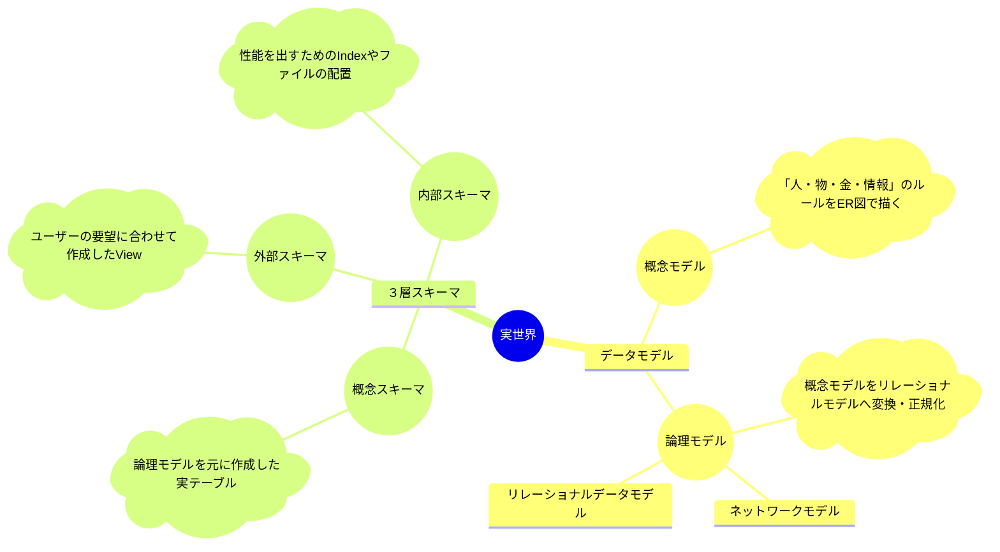
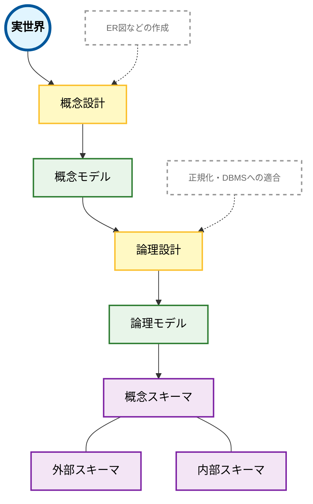
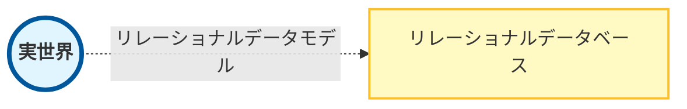

# データモデル（基幹系/OLTP）

[[目次]]

- [データモデル（基幹系/OLTP）](#データモデル基幹系oltp)
  - [データモデルと３層スキーマの違い](#データモデルと３層スキーマの違い)
  - [候補キーの定義](#候補キーの定義)
  - [リレーション](#リレーション)
  - [リレーショナル代数](#リレーショナル代数)
  - [手続き型 vs 宣言型](#手続き型-vs-宣言型)
    - [手続き型（Imperative）](#手続き型imperative)
    - [宣言型（Declarative）](#宣言型declarative)
    - [比較](#比較)
  - [集合論・述語論理](#集合論述語論理)
  - [ER図の演習](#er図の演習)

## データモデルと３層スキーマの違い

**単語の意味**

- データモデル：実世界の記号系（表現のルール）。実世界にあるデータをデータベースで表すためのモデル。
  - 概念モデル
    - 実世界のルールを図化。
    - 「どの視点（抽象度）でデータを定義したか」という設計書（モデル）の種類

  - 論理モデル
    - 概念モデルをデータベースで実現した結果。
    - 論理モデルを表す記号系として、ネットワークデータモデルやリレーショナルデータモデルなどが存在する。
    - 理論との接続: 「関係代数の射影・制限」。全体集合から必要な部分だけをビューとして切り出す考え方。

- ３層スキーマ：データの独立性を保つために、どう3つの層に分けるか。実装・構造の分離のルール。
  - 概念スキーマ
    - DB全体の「論理的な正解」。テーブル定義そのもの。
    - 理論との接続: 「集合」の定義。どのエンティティ（集合）が必要か、その関係（リレーション）は何かを定義。

  - 外部スキーマ
    - ユーザーが見る「窓口」。ビュー（VIEW）など。外部データモデルを元に作成。
    - 理論との接続: 「関係代数」。データに矛盾が起きない（関数従属性を満たす）数学的な正しさを担保。

  - 内部スキーマ
    - 物理的な「保存方法」。インデックスやストレージ配置。
    - 理論との接続: 「計算量の最適化（$O(n)$ から $O(\log n)$ へ）」。宣言されたクエリをどう物理的に速く解くかの実装。

※[[SQLと理論]]

<br>


**比較表**

比較項目|データモデル（モデリング）|3層スキーマ（アーキテクチャ）
|--|--|--|
焦点|「何を描くか」（設計手法）|「どこに配置するか」（構造原理）
タイミング|設計フェーズ（上流工程）|運用・稼働フェーズ（システム構成）
構成要素|概念・論理・物理モデル|外部・概念・内部スキーマ
目的|ビジネス要件を正確に反映すること|片方の層の変更が他方に影響しないこと

<br>

**データモデルからスキーマへの変換マップ**
part1


part2


## 候補キーの定義

**極小性**
学生テーブルが存在しているとする。
学生テーブル｛学籍番号、氏名、生年月日、住所、学部、学科、電話番号、メールアドレス｝
候補キーとして、｛学籍番号｝、｛氏名、住所｝の二パターンが考えれられる。
候補キーの定義の内、極小性を満たさないのでは？と思うが、ルールに抵触しない。
なぜなら、極小性とは、「そのセットの中からどれか一つでも属性を取り除いたら、一意に識別できなくなってしまう状態」を指すためである。
つまり、
　学籍番号の場合：一つだけで個人を特定できるため、極小性を満たす。
　氏名、住所の場合：二つが揃って初めて一人を特定できるため、片方が書けた場合は個人を特定できず、極小性を満たさない。

もし仮に、学籍番号と氏名の場合は候補キーとなるかというと、候補キーとはならない。
学籍番号のみで個人を特定することが可能であるため。

## リレーション

**リレーショナルデータベースモデルでモデリングする様子**



**単語の定義**
|用語|データベースでの呼び方|意味・内容|
|--|--|--|
|リレーション (Relation)|テーブル（表）|データ全体の集合。行と列で構成される。|
|タプル (Tuple)|レコード（行）|表の中の「1件分」のデータ。|
|属性 (Attribute)|カラム（列・フィールド）|データの「項目名」（名前、年齢、住所など）。|
|ドメイン (Domain)|データ型・値の範囲|その属性が取ることができる「値の集合（範囲）」。|

実世界のデータはそのドメインの中から選ばれた一部に過ぎないが、ドメイン自体は「ルール」や「器の性質」として、すべての候補を網羅しているものと考える。

- リレーションの定義
$R \subseteq dom(A_1) \times dom(A_2) \times \dots \times dom(A_n)$ 
  - $R$ = 理論上の全組み合わせ（直積）の中から、現時点で実際に存在しているものだけを抜き出した集合（部分集合）
  - $dom(A_1) \times \dots \times dom(A_n)$ = そのリレーション（表）において、理論上作り得る『すべての組み合わせ（行）』の総当たり

- 参照： 書籍『リレーショナルデータベース入門[第３版] ーデータモデル・SQL・管理システム・NoSQLー』p28-33 


## リレーショナル代数

**リレーショナル代数とSQL**
SQLは「宣言型」： 「何（What）」が欲しいかを記述
リレーショナル代数は「手続き型」： 「どうやって（How）」データを処理するかを記述

|演算名|リレーショナル代数の記号|SQLの構文|内容|
|--|--|--|--|
|制限 (Selection)|σ (シグマ)|WHERE|条件に合う行を絞り込む|
|射影 (Projection)|π (パイ)|SELECT|必要な列だけを取り出す|
|結合 (Join)|⋈|JOIN|複数の表を共通の列でつなげる|
|和 (Union)|∪|UNION|2つの結果を足し合わせる|
|差 (Difference)|−|EXCEPT / MINUS|片方にあり、もう片方にないデータ|
|直積 (Cartesian Product)|×|CROSS JOIN|全ての組み合わせを作る|

**リレーショナル代数とリレーショナル論理**

- リレーショナル論理：「何が欲しいか」を述べるリレーショナル論理の方が直感的で書きやすい
- リレーショナル代数：内部で効率的な手順であるリレーショナル代数に変換（コンパイル）して、高速に処理を行う

|特徴|リレーショナル代数 (Algebra)|リレーショナル論理 (Calculus)|
|--|--|--|
|考え方|手続き型 (Procedural)|宣言型 (Declarative)|
|問い方|「〜をして、次に〜をしてデータを取り出す」|「〜という条件を満たすデータが欲しい」|
|基礎理論|集合論、代数学|一階述語論理 (数理論理学)|
|構成要素|演算子 (σ,π,⋈ など)|変数、述語、量子化記号|
|SQLとの関係|内部の実行プラン（最適化）に近い|SQLの構文（記述スタイル）に近い|


**リレーショナル論理、代数、SQL**

イメージ
- リレーショナル論理：人がDBに対して操作する際の考え方。
補足： 「お腹が空いたから、『2000円以下』で『魚を使った』料理が食べたい」と条件を定義するのが論理。「どう作るか」ではなく、「どんな状態の結果が欲しいか」。
- SQL：人がDBに対して操作する際に利用する言語。
補足： 頭の中の「注文（論理）」を、レストラン（DB）が理解できる形式で書き留めたもの。SELECT 料理 FROM メニュー WHERE 価格 <= 2000 AND 材料 = '魚' と書く行為そのもの。
- リレーショナル代数：実際にDBが内部で動いている考え方。
補足： 注文を受けたシェフ（DBエンジン）が、「まず冷蔵庫から魚を取り出し（選択）、次に価格でフィルタリングし（制限）、最後にお皿に盛り付ける（射影）」という具体的なステップに分解したもの。

## 手続き型 vs 宣言型

一言でいうと、「やり方（How）」を細かく指示する or 「ほしい結果（What）だけを伝える」かの違い。

### 手続き型（Imperative）
「コンピュータがどう動くべきか」という手順（レシピ）を順を追って記述するスタイル。多くの一般的なプログラミング言語（C, Java, Pythonなど）がこの要素を保有している。

特徴: 変数の値を書き換えたり、ループ（for/while）や条件分岐（if）を使って、計算のステップを一つずつ指示する。

例: 料理の初心者に「冷蔵庫から卵を2個取り出し、ボウルに入れて、箸で10回かき混ぜて……」と細かく動作を指示するようなイメージ。

### 宣言型（Declarative）
「何が欲しいか」という結果の性質や条件だけを記述するスタイル。 SQLがその代表格。

特徴: 内部でどうやってデータを探しているか（どのメモリを参照し、どうループを回しているか）をユーザーは意識しない。システム側が最適な手順を自動で考えてくれる。

例: レストランで「オムレツをください」と注文するようなイメージ。キッチンの中でどう作っているかは客には関係ない。

### 比較

**表**
|特徴|手続き型（例: Python/C）|宣言型（例: SQL）|
|--|--|--|
|視点|どのように処理するか (How)|何を得るか (What)
|コードの例|for文で回し、ifで年齢を判定し、新しいリストにaddする。|SELECT * FROM users WHERE age >= 30|
|主な構文|for, if, append（動詞的）|SELECT, WHERE （名詞・形容詞的）|
|状態管理|変数の状態を細かく管理する。|状態の変化はシステムに任せる。|
|メリット|動作を細部まで制御できる。|コードが短く、意図が伝わりやすい。|

**実装イメージ**
Python
```python
# 元のデータ
users = [
    {"name": "田中", "city": "東京"},
    {"name": "佐藤", "city": "大阪"},
    {"name": "鈴木", "city": "東京"}
]

# 1. 空のリストを用意する
tokyo_users = []

# 2. データを一つずつ取り出す（ループ）
for user in users:
    # 3. 条件に合うかチェックする（判定）
    if user["city"] == "東京":
        # 4. 条件に合えばリストに追加する（操作）
        tokyo_users.append(user["name"])

print(tokyo_users)
```

SQL
```sql
SELECT name 
FROM users 
WHERE city = '東京';
```

## 集合論・述語論理

## ER図の演習
[[ER図]]
