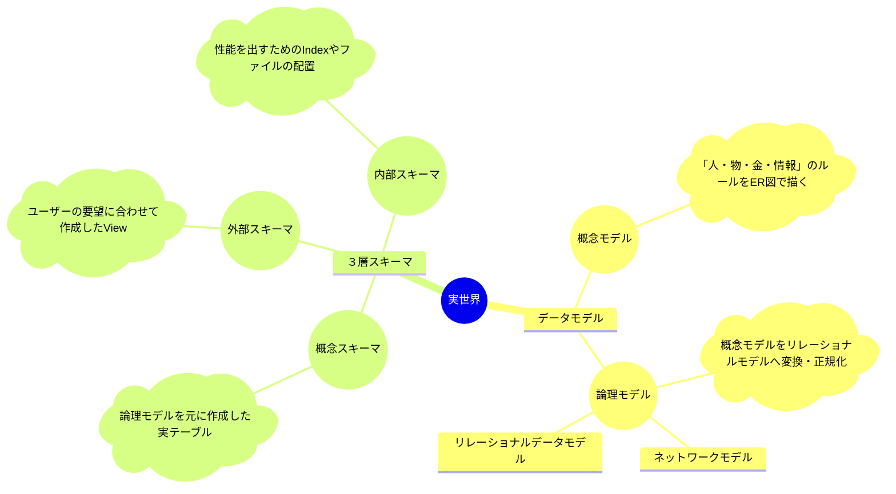
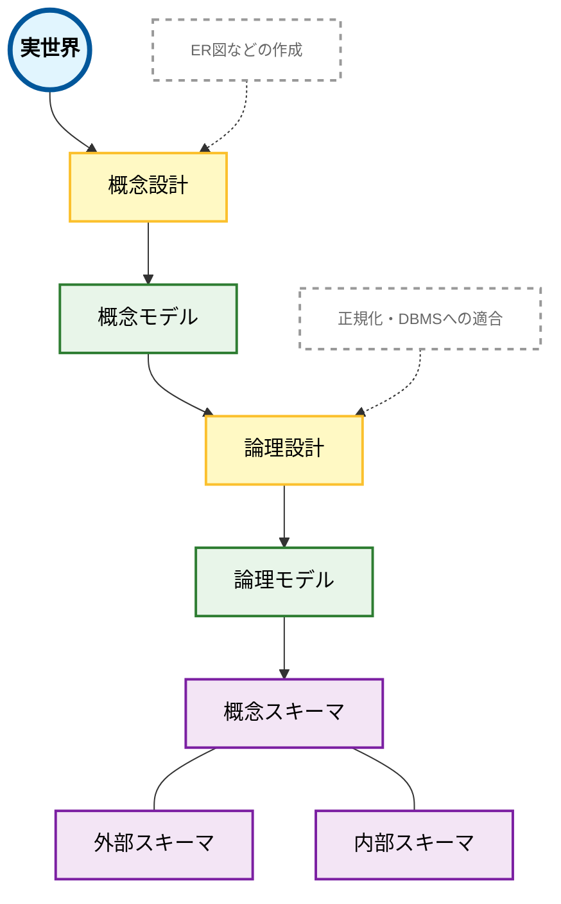

# データモデル（基幹系/OLTP）

[[目次]]

## データモデルと３層スキーマの違い

**単語の意味**

- データモデル：実世界の記号系（表現のルール）。実世界にあるデータをデータベースで表すためのモデル。
  - 概念モデル：実世界のルールを図化。「どの視点（抽象度）でデータを定義したか」という設計書（モデル）の種類
  - 論理モデル：概念モデルをデータベースで実現した結果。論理モデルを表す記号系として、ネットワークデータモデルやリレーショナルデータモデルなどが存在する。
- ３層スキーマ：データの独立性を保つために、どう3つの層に分けるか。実装・構造の分離のルール。
  - 概念スキーマ： DB全体の「論理的な正解」。テーブル定義そのもの。
  - 外部スキーマ： ユーザーが見る「窓口」。ビュー（VIEW）など。外部データモデルを元に作成。
  - 内部スキーマ： 物理的な「保存方法」。インデックスやストレージ配置。

 

**比較表**

比較項目|データモデル（モデリング）|3層スキーマ（アーキテクチャ）
|--|--|--|
焦点|「何を描くか」（設計手法）|「どこに配置するか」（構造原理）
タイミング|設計フェーズ（上流工程）|運用・稼働フェーズ（システム構成）
構成要素|概念・論理・物理モデル|外部・概念・内部スキーマ
目的|ビジネス要件を正確に反映すること|片方の層の変更が他方に影響しないこと

 

**データモデルからスキーマへの変換マップ**
part1

part2

## 候補キーの定義

**極小性**
学生テーブルが存在しているとする。
学生テーブル｛学籍番号、氏名、生年月日、住所、学部、学科、電話番号、メールアドレス｝
候補キーとして、｛学籍番号｝、｛氏名、住所｝の二パターンが考えれられる。
候補キーの定義の内、極小性を満たさないのでは？と思うが、ルールに抵触しない。
なぜなら、極小性とは、「そのセットの中からどれか一つでも属性を取り除いたら、一意に識別できなくなってしまう状態」を指すためである。
つまり、
　学籍番号の場合：一つだけで個人を特定できるため、極小性を満たす。
　氏名、住所の場合：二つが揃って初めて一人を特定できるため、片方が書けた場合は個人を特定できず、極小性を満たさない。

もし仮に、学籍番号と氏名の場合は候補キーとなるかというと、候補キーとはならない。
学籍番号のみで個人を特定することが可能であるため。

## ER図の演習
[[ER図]]
