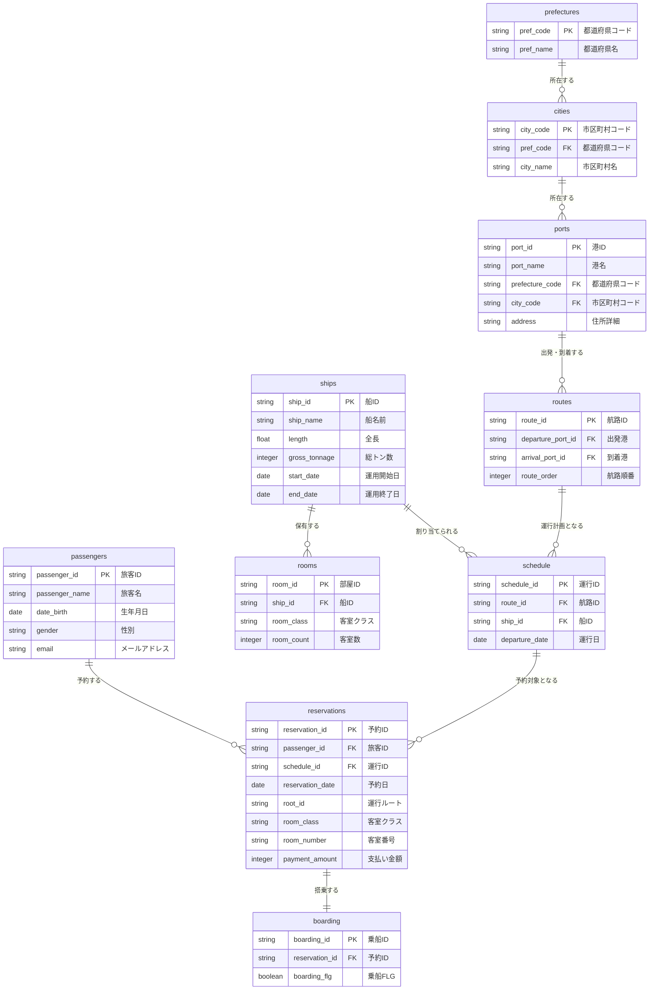

# データモデル（基幹系/OLTP）

- [[目次]]
- [[データモデリング（基幹系・OLTP）]]

## 演習

**題材：旅客船会社の予約管理**

実態と関連
 - 旅客
   - 旅客ID
   - 旅客名
   - 生年月日
   - 性別
   - メールアドレス
 - 船
   - 船ID
   - 船名前
   - 全長
   - 総トン数
   - 運用開始日
   - 運用終了日
 - 客室
   - 船ID
   - 客室クラス
   - 客室数（客室クラス毎）
 - 航路
   - 航路ID
   - 出発港
   - 到着港
   - 航路順番（A港→B港→C港とする場合：A港→B港を1、B港→C港を2とする。）
 - 港
   - 港ID
   - 港名
   - 県
   - 市
   - 住所（都道府県+市区町村+番地など）
 - 都道府県
   - 都道府県コード
   - 都道府県名
 - 市区町村
   - 市区町村コード
   - 市区町村名
 - 運行
   - 航路ID
   - 出発港ID
   - 到着港ID
   - 船ID
 - 予約
   - 予約ID
   - 予約日
   - 運行日
   - 予約者名
   - 出発港
   - 到着港
   - 客室クラス
   - 客室番号
   - 支払い金額
- 乗船
  - 乗船ID
  - 運行日
  - 出発港ID
  - 到着港ID
  - 予約者名
  - 乗船FLG

**ER図**

