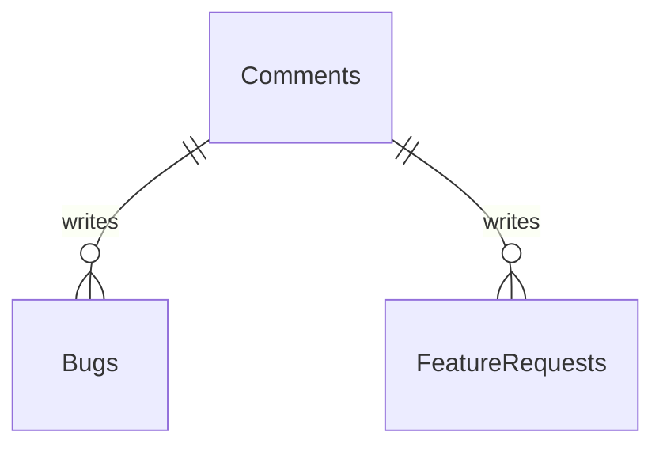
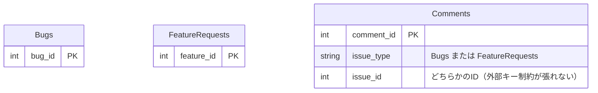
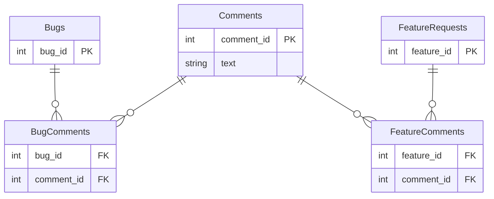
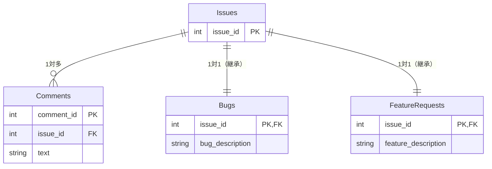

# アンチパターンと解説（データベース論理設計編）

## ジェイウォーク（信号無視）

「多対多」の関連を表現する交差テーブルの作成を避けるために、カンマ区切りのリストを利用する。
「intersection（交差点/交差テーブル）」を避けようとする行為。

アンチパターン: カンマ区切りフォーマットのリストを格納する。

```sql
-- DDL
CREATE TABLE Products (
  product_id   SERIAL PRIMARY KEY,
  product_name VARCHAR(1000),
  account_id   BIGINT
  -- 他の列. . .
  -- FOREIGN KEY (account_id) REFERENCES Accounts(account_id)
);

-- 特定のアカウントに関連する製品の検索
SELECT * FROM Products WHERE account_id ~'.*12.*';

-- 特定の製品に関連するアカウントの検索
SELECT * FROM Products AS p JOIN Accounts AS a
ON p.account_id ~ a.account_id
WHERE p.product_id = 1;

-- 解決後の特定のアカウントに関連する製品の検索/特定の製品に関連するアカウントの検索
SELECT p.*
FROM Products AS p JOIN Contacts AS c ON (p.product_id = c.product_id)
WHERE c.account_id = 34;

```

---

## ナイーブツリー（素朴な木）

階層構造を格納し、クエリを実行する。
各エントリを*ノード*と呼び、親を持たない最上位のノードは*根（ルート）*と呼ぶ。
子を持たない最下部のノードは**葉（Leaf）**と呼び、中間のノードは*非葉（nonleaf）*と呼ぶ。
組織図やスレッド形式のコメント欄で利用される。

アンチパターン: 常に親のみに依存する。

---

## ID リクワイアド（とりあえずID）

主キーの目的を確立することなくとりあえずID列を利用する。

アンチパターン: すべてのテーブルに「id」列を用いる。

冗長なキーの生成、重複行の生成を許す、キーの意味が分かりにくいなどの弊害がある。

---

## キーレスエントリー（外部キー嫌い）

親テーブルの主キー列またはユニークキー列に存在しなければならない。
外部キー制約を設定しない場合、参照整合性がなくなる。

アンチパターン: 外部キー制約を使用しない

---

## EAV（エンティティ・アトリビュート・バリュー）

可変属性をサポートする場合、もう一つ別のテーブルを作成して、属性を「行」に格納する。
行で属性を表す。

アンチパターン: 汎用的な属性テーブルを使用する

例:項目を増やさずに、「エンティティ（商品など）」「属性名（カラー、サイズなど）」「値（赤、Lなど）」をすべて縦の行として保存。
|entity_id (親)|attribute (属性名)|value (値)|
|--|--|--|
|1 (商品A)|color|赤|
|1 (商品A)|size|L|
|2 (商品B)|weight|1.2kg|

問題: 属性の取得が大変、データの整合性を保ちづらい。
解決方法:
- シングルテーブル: 複数のオブジェクトが利用するカラムをすべて保有する。
- 具象テーブル: 各オブジェクトごとにテーブルを作成する。

---

## ポリモーフィック関連

複数の親を参照したい。ただし、複数の親テーブルを参照する外部キーを宣言不可。
例：




アンチパターン: 二重目的の外部キーを使用する

例：「1つの外部キー(issue_id)が、バグのIDかもしれないし、機能要望のIDかもしれない」という、矢印の先がブレる状態。

解決方法: 関連を逆にする。

- 交差テーブルを作成


- 共通の親を作る



---

## マルチカラムアトリビュート（複数列属性）

複数の値を持つ属性を格納
例: 電話番号を４つもつなど。

アンチパターン: 複数の列を定義する

- 値の検索で複数カラムを指定する必要ある。
```sql
SELECT * FROM Bugs WHERE tag1 = '' OR tag2 = '' OR tag3 = '';
```

- 一意正の保証が不可
- 列数の不足

解決方法  : 従属テーブルを作成する。

## メタデータトリブル（メタデータ大増殖）

スケーラビリティを高める

年ごとに営業収益を分類する必要が生じた際に、年ごとのデータを格納する列を新たに追加

アンチパターン: テーブルや列をコピーする

- 行数の多い1つのテーブルを複数のテーブルに分割
- 列を複数の列に分割

→ データ整合性の管理、データの同期、一意性の保証、テーブルをまたいだクエリ実行、メタデータトリブル列の発生

解決方法: パーティショニングと正規化

- 水平パーティショニング: テーブルを横方向に分割する（例: カラムに、YYYY, MM, DD を設けるなど）
- 垂直パーティショニング: テーブルを縦方向に分割する（例: 自由記述のカラム(text型)やめったに利用されない列を分ける）
