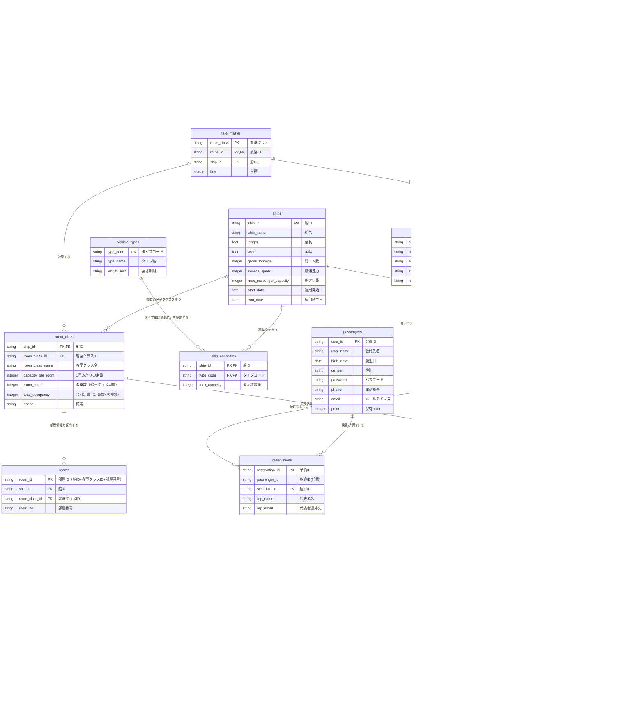

# データモデル（基幹系/OLTP）

- [[目次]]
- [[データモデリング（基幹系・OLTP）]]

## 演習

**題材：旅客船会社の予約管理**

**ER図**

```mermaid
erDiagram

    %% 乗客テーブル（乗船された方の情報）
    passengers {
      string user_id PK "会員ID"
      string user_name "会員氏名"
      date birth_date "誕生日"
      string gender "性別"
      string password "パスワード"
      string phone "電話番号"
      string email "メールアドレス"
      integer point "保有point"
    }

    %% 船マスタテーブル（保有している船の情報）
    ships {
      string ship_id PK "船ID"
      string ship_name "船名"
      float length "全長"
      float width "全幅"
      integer gross_tonnage "総トン数"
      integer service_speed "航海速力"
      integer max_passenger_capacity "旅客定員"
      date start_date "運用開始日"
      date end_date "運用終了日"
    }

    %% 車両区分マスタテーブル（車やトラックなどの区分情報）
    vehicle_types {
      string type_code PK "タイプコード"
      string type_name "タイプ名"
      string length_limit "長さ制限"
    }

    %% 船別積載能力テーブル（車やトラックなどの積載情報）
    ship_capacities {
      string ship_id PK, FK "船ID"
      string type_code PK, FK "タイプコード"
      integer max_capacity "最大積載量"
    }

    %% 客室クラステーブル（各船に用意されている客室クラスの情報）
    room_class {
      string ship_id PK, FK "船ID"
      string room_class_id PK "客室クラスID"
      string room_class_name "客室クラス名"
      integer capacity_per_room "1室あたりの定員"
      integer room_count "客室数（船＋クラス単位）"
      integer total_occupancy "合計定員（定員数×客室数）"
      string notice "備考"
    }

    %% 客室テーブル（各船に用意されている客室の情報）
    rooms {
      string room_id PK "部屋ID（船ID+客室クラスID+部屋番号）"
      string ship_id FK "船ID"
      string room_class_id FK "客室クラスID"
      string room_no "部屋番号"
    }

    %% 航路テーブル（運行する航路の情報）
    routes {
      string route_id PK "航路ID"
      string departure_port_id FK "出発港"
      string arrival_port_id FK "到着港"
    }

    %% 区間テーブル（運行する区間の情報）
    sections {
      string section_id PK "区間ID"
      string departure_port_id "出発港"
      string arrival_port_id "到着港"
      string standard_time_required "標準所要時間"
      string notice "備考"
    }

    %% 航路区間構成テーブル（航路と区間の紐づけ）
    route_sections {
      string section_id PK "航路ID"
      string route_id PK "区間ID"
    }

    %% 港テーブル（港の情報）
    ports {
        string port_id PK "港ID"
        string port_name "港名"
        string prefecture_name "都道府県名"
        string prefecture_code FK "都道府県コード"
        string city_code FK "市区町村コード"
        string address "住所"
    }

    %% 都道府県テーブル（都道府県名の情報）
    prefectures {
        string prefecture_code PK "都道府県コード"
        string prefecture_name "都道府県名"
    }

    %% 市区町村テーブル（市区町村の情報）
    cities {
        string city_code PK "市区町村コード"
        string prefecture_code FK "都道府県コード"
        string city_name "市区町村名"
    }

    %% 運行スケジュールテーブル（運行スケジュールの情報）
    schedule {
      string schedule_id PK "スケジュールID"
      string route_id FK "航路ID"
      string section_id FK "区間ID"
      date departure_date "出発日"
      date arrival_date "到着日"
      timestamp departure_time "出発時刻"
      timestamp arrival_time "到着時刻"
      string ship_id FK "船ID"
    }

    %% 予約基本情報テーブル（ヘッダー情報：誰が、いつ、どの便を）
    reservations {
      string reservation_id PK "予約ID"
      string passenger_id "旅客ID(任意)"
      string schedule_id FK "運行ID"
      string rep_name "代表者名"
      string rep_email "代表者連絡先"
      date reservation_date "予約日"
    }

    %% 予約明細情報テーブル（ボディ情報：誰が、どの区分で、どの部屋か）
    reservation_details {
      string reservation_id PK,FK "予約ID"
      string detail_id PK "明細ID"
      string passenger_id "旅客ID(任意)"
      string passenger_type "区分(大人/小人)"
      string room_class_id "希望クラスID"
      integer applied_fare "適用運賃"
    }

    %% 在庫テーブル（残りの部屋数）
    inventry {
      string route_id FK "航路ID"
      string section_id PK,FK "区間ID"
      date departure_date PK "出発日"
      timestamp departure_time PK "出発時刻"
      string ship_id PK,FK "船ID"
      string room_class_id PK "客室クラスID"
      integer room_count "客室数（船＋クラス単位）"
      integer remaining_room_cnt "残室数（船＋クラス単位）"
      integer num_of_people "1室あたりの定員"
      integer remaining_num_of_people "残人数"
    }

    %% 発券テーブル（発券情報）
    ticketing {
      string ticket_id PK "発券ID"
      string reservation_id FK "予約ID"
      string ticket_type "搭乗券種別"
    }

    %% 搭乗実績テーブル（搭乗情報）
    boarding {
      string boarding_id PK "乗船ID"
      string reservation_id FK "予約ID"
      string ticket_id FK "発券ID"
      boolean boarding_flg "乗船FLG"
    }

    %% 運賃テーブル（運賃タイプと運賃の情報）
    fare_master {
      string room_class PK "客室クラス"
      string route_id PK, FK "航路ID"
      string ship_id FK "船ID"
      integer fare "金額"
    }

    prefectures ||--o{ cities: "一都道府県に複数の市町村が所在する"
    cities ||--o{ ports: "一市町村に複数の港が所在する"
    ports ||--o{ routes: "出発・到着する"

    ships ||--o{ ship_capacities: "積載枠を持つ"
    vehicle_types ||--o{ ship_capacities: "タイプ毎に積載能力を設定する"

    ports ||--o{ routes: "出発港・到着港"
    ports ||--o{ sections: "出発港・到着港"
    routes ||--o{ route_sections: "ルートの構成要素"
    sections ||--o{ route_sections: "セクションの構成要素"

    ships ||--o{ room_class: "複数の客室クラスを持つ"
    room_class ||--o{ rooms: "部屋情報を保有する"
    ships ||--o{ schedule: "割り当てられる"
    routes ||--o{ schedule: "運行計画となる"
    fare_master ||--o{ room_class: "計算する"
    fare_master ||--o{ routes: "計算する"

    passengers ||--o{ reservations : "乗客が予約する"
    schedule ||--o{ reservations: "便に対しての予約"
    schedule ||--o{ inventry: "便ごとの在庫管理"
    room_class ||--o{ inventry: "クラス毎の在庫管理"

    reservations ||--|{ reservation_details : "人数分作成する"
    reservations ||--o{ ticketing: "発券する"
    ticketing ||--|| boarding: "搭乗する"
```
